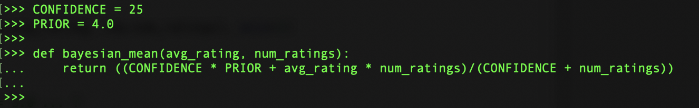
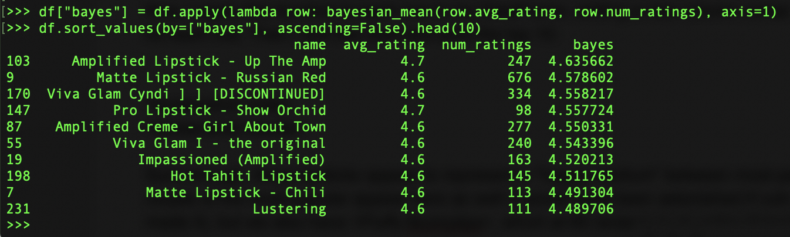

# Lipstick Analyzer
### Using Bayesian analysis to predict average ratings of MAC lipsticks

As a makeup enthusiast, I love going to the MAC store and finding a great new lipstick. But as a scientist, I never go without researching the product reviews first. And one of my biggest frustrations when reading reviews on websites such as MakeupAlley is that it's easy to identify the _most popular_ shades and the _top rated_ shades. But I want to know what the _best_ shades are, where "best" takes into account both the number of reviews _and_ the average rating. Usually I attempt this evaluation intuitively, scrolling through many pages of reviews and manually selecting the lipsticks that seem to be both popular and highly rated. But this process isn't rigorous, and it definitely isn't time-efficient.

So I do some research to see if there is a formal way of identifying the best products in a 5-star rating system, and I find this excellent [blog post][ref1] by District Data Labs.  It describes how to use Bayesian estimation to predict the expected rating for each product after its number of reviews surpasses the minimum threshold we consider reliable. This sounds like exactly what I'm looking for, so I follow along and apply the author's computations to my data.

First, though, I need a dataset to work with. I write a [web scraper](scraper.py) that extracts the name, average rating, and number of reviews of each MAC lipstick on MakeupAlley. It produces a [.csv file](data.csv) with 1005 entries.

Next, I load the data into a pandas.DataFrame, excluding the "percent buy again" column since I'm not going to use it at the moment, and specifying the data types of the other columns:

Now the DataFrame looks like this:

For starters, I compare the top 10 most popular lipsticks...

...with the 10 most highly rated lipsticks:

Clearly, none of the top-rated lipsticks has a large enough group of reviewers to be reliable. The group of most popular lipsticks seems more promising ... but 6 of these have average ratings of 4.2 or lower, which, as we'll discuss later, is actually pretty low for this dataset.

To get a general overview of the data, I generate a scatter plot of average rating vs number of ratings:

We can see a couple interesting things here: all lipsticks with extremely high or low ratings have a small number of reviews, which makes sense.  As the number of reviews increases, the range of average ratings narrows to between 4.0 and 4.5. However, the data is so tightly clustered to the left that it's hard to get a clear picture of what the density looks like. So next, I use the author's code to generate a hex graph of the data with a logarithmically scaled x-axis:

 

The goal is to be able to look at where the data is most dense, and use that to generate an estimate of the _confidence_ - the minimum number of reviews a lipstick must have before we consider its rating "reliable" - and the _prior_ - the average rating that is approached as the number of reviews increases.

Looking at the graph, I see that the darkest blue cluster (indicating the highest number of data points) appears where the number of reviewers is between 10 and 30, and the average rating is between 4.0 and 4.5. This global average may seem high for a 5-point scale; however, I've observed that lipstick reviews generally tend to skew high compared to other cosmetics, maybe because lipstick is easy to use and - unlike foundation - its success is not dependent on highly individual factors like age and skin type. Therefore, I decide to use C=25 for my confidence and m=4.0 for my prior.

Next, I use the observed confidence and prior to generate a "Bayesian mean" for each lipstick.  Essentially, this is a prediction of the rating a lipstick would get if it had _C_ additional reviews at _m_ stars each.  Thus, the equation looks like this:

I apply this function to each row in my DataFrame, adding a new column containing the Bayesian mean for each row. Then I sort the rows and print the top 10:

Sure enough, these lipsticks appear to represent a happy medium between most-popular and top-rated. One of the most popular, Russian Red, appears in this list as well, but the rest have less than half that number of reviews while yet having high average ratings of 4.6-4.7.

The Bayesian winner is "Up The Amp", which I've never heard of before. So I Google it, finding out that it's ... [bright orchid purple][ref2]?  Hmmm. Looking up the other winners reveals that several of them are lurid neon pinks and violets. I guess what I really need is a personalized recommender system that would factor in MY color preferences when calculating the top 10.  A project for another weekend...

[//]: # 
[ref1]: https://medium.com/district-data-labs/computing-a-bayesian-estimate-of-star-rating-means-651496a890ab
[ref2]: https://www.temptalia.com/product/mac-cosmetics-lipstick/up-the-amp/ 